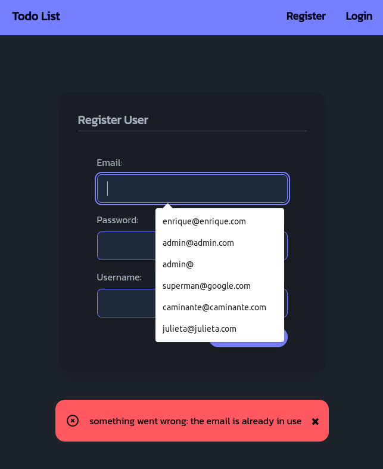

<div align="center">

# Full stack Demo app made in frameworkless Go (Todo App 🧬), centralized HTTP error handling, CRUD to a SQLite database and HTMx-powered frontend


<hr />

 

</div>

<br />

>[!NOTE]
>***This application is an clone of this [repository](https://github.com/emarifer/rust-axum-askama-htmx-todoapp) of mine (rust-axum-askama-htmx-todoapp), but made in `Golang`.***

<hr />

### 🤔 Why is the standard library all you need? (or almost)&nbsp;

In the world of Go, the Unix philosophy is followed which says:

- Write programs that do one thing and do it well.
- Write programs to work together.
- Write programs to handle text streams because that is a universal interface.

This is why Go users tend to avoid using (perhaps abusing) frameworks and libraries. This way of thinking has one result: our project is more stable and maintainable. You can find these ideas more developed in this [post](https://threedots.tech/post/best-go-framework/). All of this is more true since version `v.1.22` of Go was released, in which notable improvements in the `net/http` package allow advanced routing techniques that until now we could only achieve comfortably through the use of other libraries.

<div align="center">


###### It's practical to change parts of your project without killing it.

</div>

It's true that "doing things yourself" is going to involve a certain amount of boilerplate. But with Go until you build large applications the balance between boilerplate and stability/maintainability will remain at acceptable levels.

I present here an application template for beginners (a todoapp, always the beginning for Web development 🤦) that includes the most frequent topics: routing, middlewares, centralized error handling, authentication with jsonwebtoken, use of the Go context to pass request-scoped data and some others, in addition to some small "hacky trick" 😀.

I want to make it clear that none of the parts that make up this application together constitute a recipe to create a whole. My purpose in creating it has been that everything works as expected. They only constitute a list of small pieces/solutions that you can (and should) use separately when creating your projects.

In any case, solving these problems, common in backend/fullstack development, has a consequence: you learn Go (or any other programming language) better and faster.

For all these reasons, I have given up using libraries/frameworks. There are only 3 dependencies in this project:

- one for hashing passwords
- another for authentication with JWT
- finally the driver for the Sqlite3 DB that is used for storage

None of them have indirect dependencies.

The architecture follows a typical "onion model" where each layer doesn't know about the layer above it, and each layer is responsible for a specific thing. Although the application is extremely simple, we use this pattern to illustrate its use in more complex applications.

Layering an application in this way can simplify code structure, since the responsibility of each type is clear.

To ensure that each part of the application is initialized with its dependencies, each struct defines a constructor (the New function in this example).

<div align="center">



</div>

The use of [</>htmx](https://htmx.org/) allows behavior similar to that of a SPA, without page reloads when switching from one route to another or when making requests (via AJAX) to the backend. Reading Carson Gross's book [Hypermedia System](https://hypermedia.systems/) is very illuminating.

On the other hand, the </>htmx `response-targets` [extension](https://v1.htmx.org/extensions/response-targets/) allows you to specify different target elements that will be exchanged when different HTTP response codes are received. In our case it makes it easier to replace the entire response body with the corresponding error page.

The styling of the views is achieved through `Tailwind CSS` and `DaisyUI` that are obtained from their respective CDNs.

Likewise, the `SweetAlert2` library is used, a substitute for JavaScript pop-up boxes. In the same way it is obtained from its respective CDN.

Finally, minimal use of [_hyperscript](https://hyperscript.org/) is made to achieve the action of closing the alerts when they are displayed or giving interactivity to the show/hide password button in its corresponding input.

---

### Features 🚀

- [x] **Use of "native" middlewares:** Middleware chaining has been solved with an elegant and reusable solution to avoid having to wrap one middleware inside another if your application requires many of them.
- [x] **Centralized error management:** Middleware is also used to handle errors centrally. More specifically, since handlers are what return an error, the Adapter design pattern is used when implementing the ServeHTTP method (of the http.Handler interface), which handles errors.
- [x] **Flash Messages:** They give the user information about the result of their actions (success/error). No third-party library is used to implement this feature.
- [x] **Using Go's native templating engine:** Although the `a-h/templ` [library](https://github.com/a-h/templ) allows type checking of the data we pass to our templates, I believe that even medium-sized projects the security/coding speed ratio is more favorable with native Go templates... and with zero dependencies.
- [x] **Authentication with JWT:** which frees the server from saving user data (in memory or in DB). Furthermore, the library used does not have indirect dependencies.
- [x] **Structured Logging with slog:** I have "wrapped" the API of the `slog` package to customizing it and make it prettier. The logger prints both the output of the handlers or their result completed with an error, as well as the information related to the application's assets.
- [x] **Using the JavaScript library for front-end `htmx`:** Obtained via their CDN.
- [x] **Using interfaces in the `services` package:** The architecture follows a typical "onion model" where each layer doesn't know about the layer above it, and each layer is responsible for a specific thing, in this case, the `services` (package) layer, which allows for better separation of responsibilities and `dependency injection`.

---

### 🖼️ Screenshots:

<div align="center">

###### Terminal showing app logger:


###### Todo List Page with success alert & Sign Up Page with error alert:

&nbsp;&nbsp;

<br>

###### Task update page & popup alert based on SweetAlert2:

&nbsp;&nbsp;

<br>

###### Centralized handling of 404 & 500 errors:

&nbsp;&nbsp;

<br>

</div>

---

### 👨‍🚀 Getting Started:

Besides the obvious prerequisite of having Go on your machine, you must have [Air](https://github.com/air-verse/air) installed for hot reloading when editing code.


Start the app in development mode:

```
$ air # Ctrl + C to stop the application
```

Build for production:

```
$ go build -ldflags="-s -w" -o ./bin/go-frameworkless-htmx ./cmd/go-frameworkless-htmx/main.go # ./bin/main to run the application / Ctrl + C to stop the application
```
---

### Happy coding 😀!!
